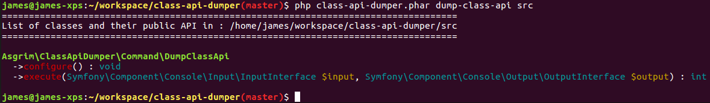

# class-api-dumper

Take a path, dump its class API. Just a quick tool.

## Installation/Usage

 - Visit https://github.com/asgrim/class-api-dumper/releases
 - Download the PHAR for the latest release
 - Run it like `php class-api-dumper.phar dump-class-api <path>`

### Example



```
$ php class-api-dumper.phar dump-class-api src
====================================================================================
List of classes and their public API in : /home/james/workspace/class-api-dumper/src
====================================================================================

Asgrim\ClassApiDumper\Command\DumpClassApi
  ->configure() : void
  ->execute(Symfony\Component\Console\Input\InputInterface $input, Symfony\Component\Console\Output\OutputInterface $output) : int
```

## Making releases

Note: should be automated in future...

 - `phive install`
 - `tools/box compile`
 - `git tag -s <version>`
 - `git push origin <version>`
 - Make release on GitHub, upload `class-api-dumper.phar`
